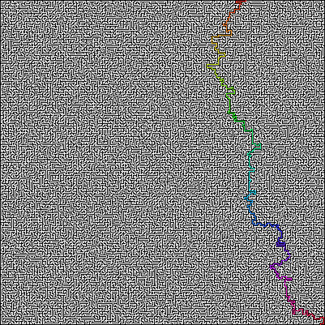
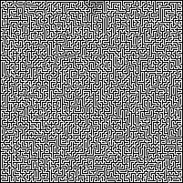

# Crystal-Maze

A* Path finding for PNG mazes, from Ruby now in Crystal! Using StumpyPNG!
Now ×40 faster than its Ruby counterpart: [A-Star](https://github.com/Demonstrandum/A-Star)



## Installation
Build it from source:
Clone and enter repository:
```shell
git clone https://github.com/Demonstrandum/Crystal-Maze.git && cd Crystal-Maze
```
then install dependencies with [`shards`](https://github.com/crystal-lang/shards) ([StumpyPNG](https://github.com/stumpycr/stumpy_png)):
```shell
shards install
```
and run the make file:
```shell
make
sudo make install clean
#sudo make uninstall # to remove the program
```

## Usage
To run the program itself:
```shell
maze ~/Pictures/yourImage.png
```
This will solve the maze and make and image with the suffix "-solved"<br />
e.g. `yourImage-solved.png` in the same location as the input image.


You can also add optional arguments of heuristic distance type, verbosity and wheather to draw nodes or not. For heuristic distance just type `euclidean` or `manhattan`  as argument for distance calculation type, these are the only two currently supported. Showing nodes is done with the argument `--show-nodes` and for verbosity (prints the nodes of the final path) either `-v`, `verbose` or `--verbose`.

For example:
```shell
maze euclidean -v hipMaze.png --show-nodes
```

### GIFs

> Maze being mapped out by flood and then solved with ***A****

You can animate the solving with the `--gif` argument, this looks better with `--show-nodes` as you can see the nodes being placed and spreading. e.g.
```shell
maze mazes/50-maze.png --show-nodes --gif
```
The gif will most likely be very slow, so you can drop some frames to speed it up:
```shell
maze mazes/normal.png --show-nodes --gif --gif-speed 14
```
The above means: only keep *every 14th* frame.

which generates `mazes/50-maze-solved.gif`
**Be careful**, when making GIFs with large mazes, the program will use *a lot* of memory and may freeze your computer!

## Maze PNG requirements
The start and end points of the maze must be white and be from top or left to bottom or right, if this is not true, then it means the maze has a black border, in which case it will find a green pixel (doesn't have to be perfect green) and sets that as the start point and then finds a red pixel (doesn't have to be perfect red) and sets that as the end point.

---

P.S. It's highly recommended that the maze's walls and paths are 1 pixel wide as the program draws and reads the paths as one pixel.  
